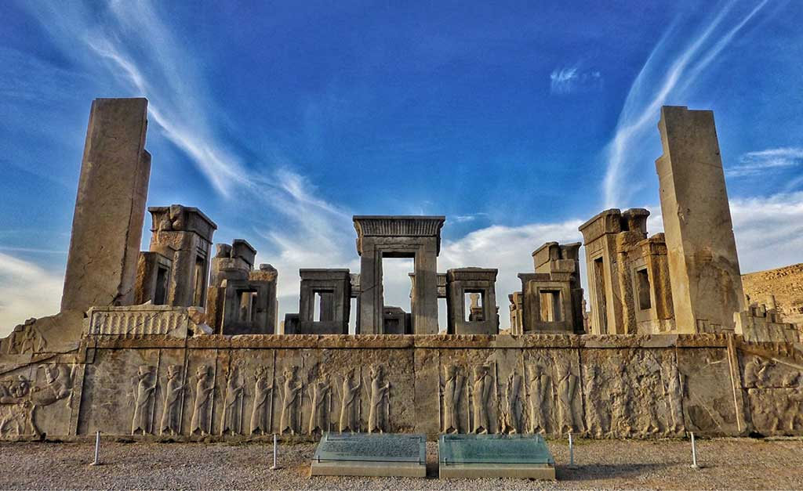
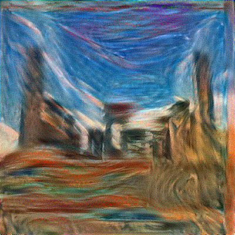

### Neural Style Transfer

Neural Style Transfer (NST) is one of the most fun and interesting optimization techniques in deep learning. It merges two images, namely: a <strong>"content" image (C)</strong> and a <strong>"style" image (S)</strong>, to create a <strong>"generated" image (G)</strong>. The generated image G combines the "content" of the image C with the "style" of image S. 

We will use the following image of ancient city of Persepois as the concent image:

We also use the style of the following paint, as the style image.

The result is pretty cool!

